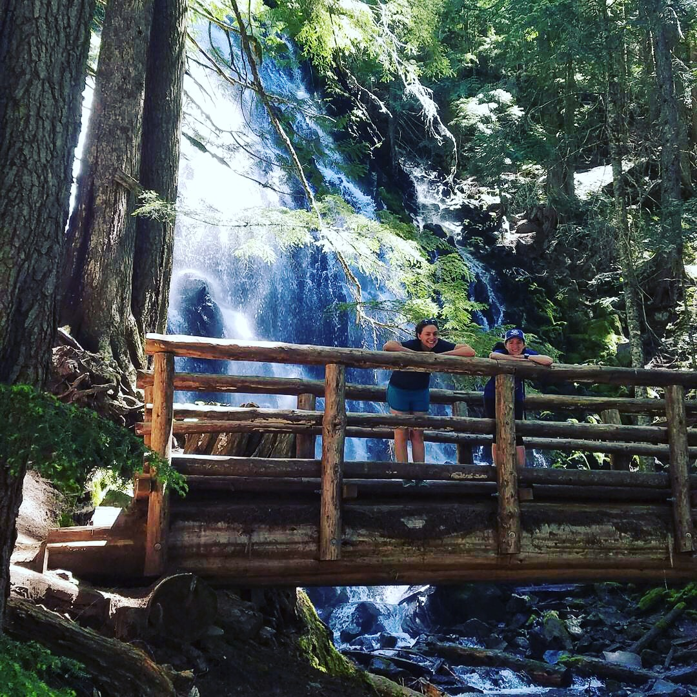
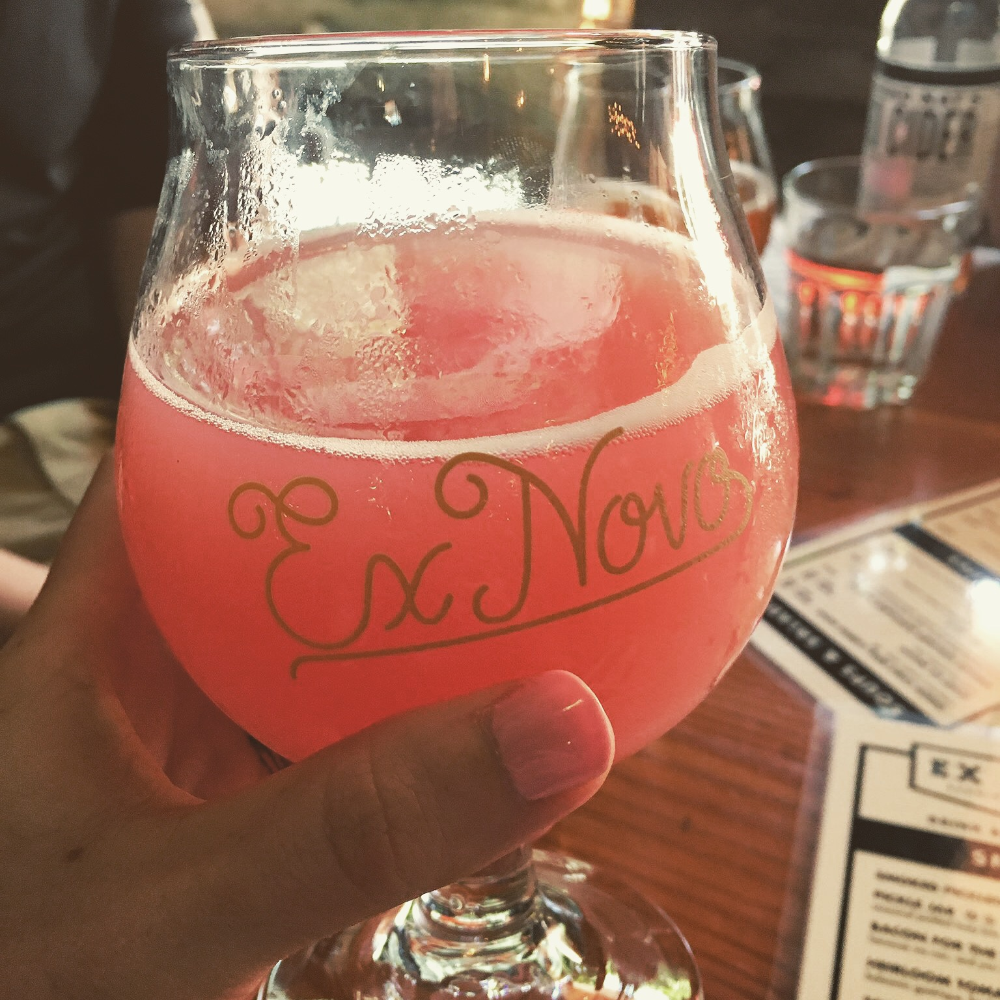
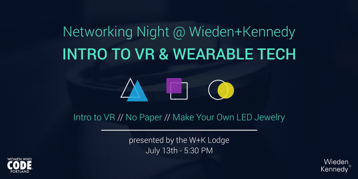

Happy Monday! It's the holiday weekend (happy 4th, everyone), so I have a little extra time to play with code that I've been wanting to play around with for a while. For those who like AWS, I wrote a quick blog post on AWS Lambda's basic setup.

A quick weekend recap: I had brunch this weekend with friends, and got to meet the awesome Charity Majors (Founder of [Honeycomb.io](https://twitter.com/honeycombio) and [@mipsytipsy](https://twitter.com/mipsytipsy) on Twitter)!

It was a hot one in Portland on Sunday (88\*!), so Dave, my friend Kate and I also went on a hike to Ramona Falls on Mt Hood, followed by a very pink beer at Ex Novo.

  

    <figure>
    
    </figure>
  

  

    <figure>
    
    </figure>
  

<!--more-->

Here's what's going on in Portland this week and next week:

### Events

If you're in PDX tech:

- [Fri, 7/7: Hackster Microsoft Roadshow.](https://www.eventbrite.com/e/the-hackster-microsoft-roadshow-2017-portland-tickets-35223388102?aff=es2) Hackster.io, a project site for open source hardware projects, is coming to Portland on Friday, July 7th. They're running a four hour lab focused on how to use Azure for IoT. Free food, coffee and workshop for all who attend.
- [Tues, 7/11: Portland ReactJS Lighting Talks and Hack Night.](https://www.meetup.com/Portland-ReactJS/events/241125197/) Portland ReactJS is holding a monthly lightning talk and presentation night at New Relic.
- [Thurs, 7/13: PDXNode Presentation Night.](https://www.meetup.com/pdxnode/events/238627202/) So bummed that I can't attend this week, but if you're free, you should. PDXNode is an awesome group, and this month they're starting off with a friendly Node quiz! Prizes include awesome learning materials sponsored by Cloudflare (eg. Books like "Effective JavaScript" by David Herman, and "Node.js in Action" by Harter, Cantelon, Rajlich, and Holowaychuk).
- [Thurs, 7/13: WWC Networking Night @ Wieden+Kennedy - Intro to VR & Wearable Tech.](https://www.eventbrite.com/e/networking-night-wiedenkennedy-intro-to-vr-wearable-tech-tickets-35443175492) Pretty excited about this one - and it's on my birthday! Our July Networking Night will be hosted by the W+K Lodge, Wieden + Kennedy's design engineering group. There will be a series of workshops including an Intro to VR Development, a Live Art Demo of Google’s Tilt Brush app, and a Build Your Own LED Bracelet Wearable. Come by!

  <figure>
    
  </figure>

### Non-Tech Events:

Promoting my usual two running meetups; if you need a crew of people to run with, come join us:

- [Portland Running Company: Thirsty Thursday 4-6 mile run @ 6:00p.](https://www.meetup.com/Portland-Running-Co-Weekly-Group-Runs/events/238871360/)
- [PDX Trail Runners: Saturday at 9:00a @ Forest Park, on the Lower MacLeay Park entrance.](https://www.meetup.com/PDX-Trail-Runners/events/237741875/)

### Articles

Here are a few articles, podcasts and assorted things that I’ve enjoyed over the past week — give yourself a little mental boost on your Monday morning:

- Really enjoyed @noopkat's livestream this week, [where she did a live unboxing of the newest AdaBox 004 and worked an avrgirl-arduino.](https://www.twitch.tv/videos/156064343) I'm a big fan of her streams in general, but really liked this one.
- Tomomi Imura wrote a great blog post on [building a sentiment analysis bot with IBM Watson and Raspberry Pi.](https://medium.com/slack-developer-blog/building-a-sentiment-analysis-bot-with-ibm-watson-and-raspberry-pi-eeb399bb8803) She uses Express and ngrok, so the code is very accessible. I have a Raspberry Pi 2, and tried spinning up the Express server - going to head to Ctrl-H this week and see if I can use their 3D printer, instead of ordering IBM's TJBot.
- This is not at all light reading, but a good friend recently recommended [Functional-Light JavaScript by Kyle Sampson, author of 'You Don't Know JS', one of my favorite series.](https://github.com/getify/Functional-Light-JS/tree/1681b7d181367066edd3bb81c4cc18ff44ed7406) I want to get better at functional programming and organizing by code and this has been a good read so far - tempted to get a physical copy so I can read it out in the sun and take a pen to it.
- Finally, a shoutout to [Vaidehi Joshi's Base CS Series, where she breaks down a computer science concept every Monday.](https://medium.com/basecs) Her newest article on heaps is a great read.

Have a great week, everybody!
