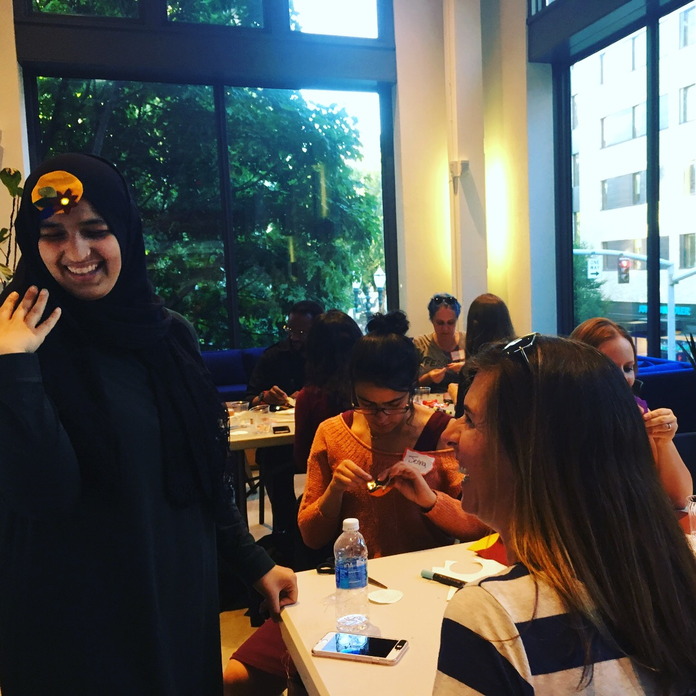
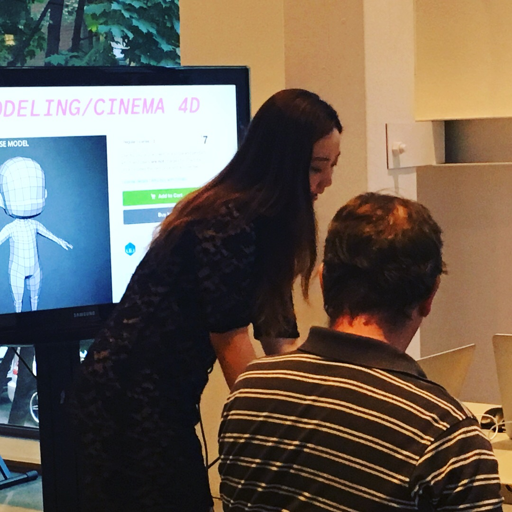
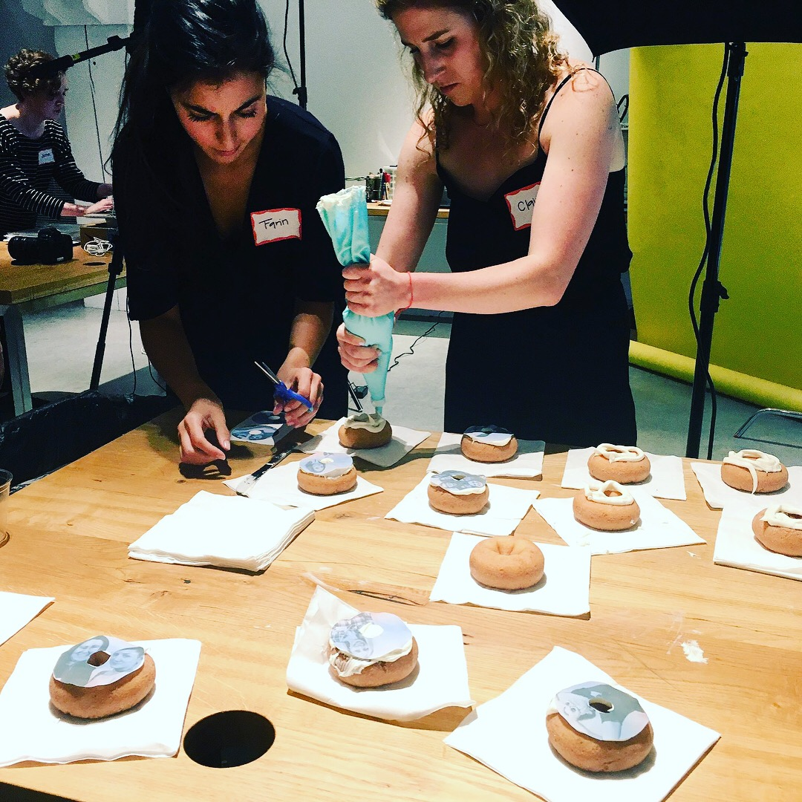
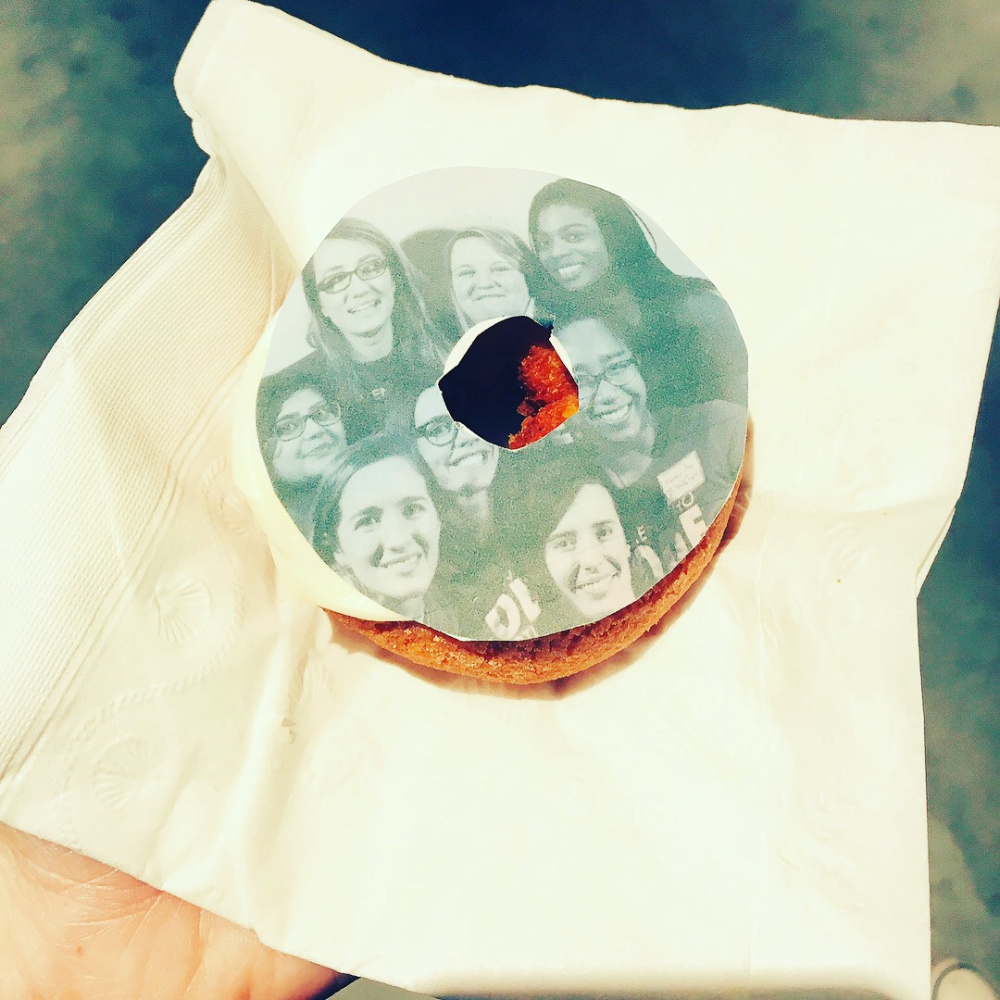

Happy Monday!

Thursday's Wieden+Kennedy event was a smashing success. We had great VR demos with Unity, an LED wearable workshop led by engineers of the Lodge team and a donut photo booth: a booth that printed sugar-spun icing photos onto donuts, letting you eat your own face.

  

    <figure>
    
    </figure>
  

  

    <figure>
    
    </figure>
  

  

    <figure>
    
    </figure>
  

  

    <figure>
    
    </figure>
  

Thanks so much to the ladies of W+K and Women Who Code who made everything possible- and who sang "Happy Birthday" to me at the end of the event.

<!--more-->

Here's what's going on in Portland this week and next week:

### Events

If you're in PDX tech:

- [Tues, 7/18: Design and Product Study Night.](https://www.meetup.com/Women-Who-Code-Portland/events/240763387/) Our product and design study night meets once per month at New Relic. Come share your portfolio and work on side projects with others!
- [Thurs, 7/26: JavaScript Study Night.](https://www.meetup.com/Women-Who-Code-Portland/events/240373631/) The Javascript study night is always one of my favorite Women Who Code study nights. This week, we'll be working through a Wes Bos tutorial and pairing on any existing projects.
- [Thurs, 7/27: PDX Node Hack Night.](https://www.meetup.com/pdxnode/events/241094722/) PDXNode Hack Nights are your opportunity to enjoy a low-pressure JavaScript-centric environment where you shouldn't feel like you're supposed to do anything. Hang, hack, learn, or do whatever you’re interested in doing. 🙌

While not happening this week, I also wanted to give a shout out to two upcoming longer-form conferences:

- [August 1-3: Portland DevOps Days.](https://www.devopsdays.org/events/2017-portland) DevOps Days is an international conference on all things DevOps, and PDX's includes an awesome night event at OMSI. Let me know if you'll be there - I'm volunteering!
- [August 8-9: Alexa Skills Tour, Powered by Voicehacks.](https://www.voicehacks.com/tour/portland) Throwing this out there now, as the first 100 registrations are free. The two day workshop will cover how to design, build, and launch skills for Alexa.

### Non-Tech Events:

Promoting my usual two running meetups; if you need a crew of people to run with, come join us:

- [Portland Running Company: Thirsty Thursday 4-6 mile run @ 6:00p.](https://www.meetup.com/Portland-Running-Co-Weekly-Group-Runs/events/238871360/)
- [PDX Trail Runners: Saturday at 9:00a @ Forest Park, on the Lower MacLeay Park entrance.](https://www.meetup.com/PDX-Trail-Runners/events/237741875/)

### Articles

Here are a few articles, podcasts and assorted things that I’ve enjoyed over the past week — give yourself a little mental boost on your Monday morning:

- Dev.To ran a good #devdiscuss this week about good and bad programming habits. [You can read some of the highlights here, or click the hashtag on Twitter.](https://dev.to/thepracticaldev/good-and-bad-dev-habits-from-perfectionism-and-to-git-commit-messages)
- Wired had an article this week that was getting passed around my Twitter timeline, [about making code more tinkerer friendly.](https://www.wired.com/story/clive-thompson-tinker-with-code/) I remember messing with my first bits of code on Xanga and Gaia Online, and love the concept.
- Speaking of tinker-friendly: I want to give a shout out to Glitch, which I just started using for a Leaflet project with Hack Oregon; [you can view and remix my project here.](https://glitch.com/edit/#!/grocery-geojson) Uses some QGIS and geoJSON, but would love people to tinker with it.
- Finally, I've been reviewing some JavaScript basics for a new project and [found this excellent article on hoisting.](https://dev.to/imwiss/understanding-hoisting-in-javascript) It covers a pretty basic concept, but was a good refresher.

Have a great week, everybody!
