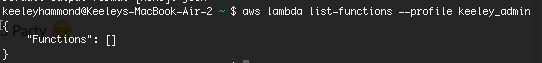

It's the holiday weekend (happy 4th, everyone), so I have a little extra time to play with code that I've been wanting to play around with for a while.

This weekend, I played around with Amazon Lambda. I've used AWS in the past (mainly S3), but had never tried Amazon's serverless solution, and wanted to see what it was capable of.

---
### What is Lambda?
AWS has become an enormous suite of services, and Lambda is the "serverless" option under the greater AWS umbrella.

---
### Setting Up Your First Instance
I followed the tutorial in the AWS docs for 'Getting Started with Lambda'; [you can see the tutorial here.](http://docs.aws.amazon.com/lambda/latest/dg/getting-started.html) I'm not a fan of the AWS docs in general, but found this to be pretty straightforward.

If you've set up an AWS instance before and already have the AWS CLI installed, you can go ahead and skip ahead to Step 2: Hello World. If you haven't set up your AWS CLI, [the instructions are actually pretty good, albeit verbose (but I think that's true of most of AWS' docs).](http://docs.aws.amazon.com/cli/latest/userguide/cli-chap-getting-started.html#cli-quick-configuration)

Go ahead and install the AWS CLI and run the two tests to make sure it's installed. Note down your account id and the secret key - I downloaded mine.

One thing for Mac users: **make sure you have Python installed from python.org, so that you have a global version of `pip`.** I had Python installed through OSX's defaults, and it had wiped out `pip` in the last update, which was very cool and good until I figured out what was going on. 

Also, the docs say that you can configure with `aws configure`, but later commands threw errors for me until I reconfigued my admin user with `aws configure --profile [adminfoo]`. So if you're getting 'not found' errors, trying reconfiguring with that.

When your install is successful, your screen should look like this:

<figure>
  
</figure>

---
### 'Hello World' Lambda Function and Console

Once your CLI is up, it's time to create your first Lambda function. The docs used Python as their default blueprint; the most basic lambda will look like the following in Python:

```py
def lambda_handler(event, context):
  return "Hello World!"
```

I really wanted to use Node, however, so I deviated from the tutorial slightly and created my blueprint in Node. The Node version is pretty similar:

```js
exports.handler = function(event, context) {
 context.succeed(“Hello, World!”);
};
```

This is fine and it feels really satsifying to get that going! 

Let's try to create a more complex function, though. Here's what one might look like, [courtesy of RisingStack](https://blog.risingstack.com/getting-started-with-aws-lambda-and-node-js/):

```js
/* Initialization part starts here */
const mysql      = require('mysql')  
const connection = mysql.createConnection({  
  host     : process.env.MYSQL_HOST,
  user     : process.env.MYSQL_USER,
  password : process.env.MYSQL_PASSWORD,
  database : process.env.MYSQL_DB
})
/* Initialization part ends here */

/* Handler function starts here */
exports.handler = (event, context, callback) => {  
  const sql = 'SELECT * FROM users WHERE id = ' + connection.escape(event.userId)
  connection.query(sql, function (error, results, fields) {
    if (error) {
      return callback(error)
    }
    callback(null, results)
  })
}
/* Handler function ends here */
```
With the more complex function, it's a little easier to see the parts of the lambda function. Here's a breakdown:

* *initialization* - this is the part of the code snippet that will only run once per container creation. This is a good place to create database connections.
* *handler function* - this function will be called every time our Lambda function is executed.
    * *event* - this variable is used by Lambda to pass in event data to the handler (like an HTTP request).
    * *context* - the context variable is used to pass in runtime information for the Lambda function, like how much time is remaining before the function will be terminated.
    * *callback* - By using it, you can explicitly return data to the caller (like an HTTP response)

---
### Calling a new Lambda function for the first time

When you deploy your Lambda function (or update an existing one), a new container will be created for it.

Your code will be moved into the container, and the initialization code will run before the first request arrives to the exposed handler function.

The Lambda function can complete in one of the following ways:

* timeout - the timeout specified by the user has been reached (defaults to 5 seconds as of now)
* controlled termination - the callback of handler function is called
* default termination - if all callbacks finished execution (even without the callback of the handler function is called)
* crashing the process

---
### Consequent calls to an existing Lambda function

For the next calls, Lambda may decide to create new containers to serve your requests. In this case, the same process will happen as described above, with initialization.

However, if you have not changed your Lambda function and only a little time passed since the last call, Lambda may reuse the container. This way it saves the initialization time required to spin up the new container and your code inside it.

Editing code inline is great for getting your feet wet with Lambda, but it's definitely not scalable. For real-world projects, we’ll need an automated way for zipping up our lambda with the node modules and pushing it to AWS. I have a few other projects to work on this week, but I'm going to do a part two of this blog post next weekend that covers moving past 'Hello World'.

---
### Final Thoughts

I'm looking forward to doing more with Lambda. This was a good first dip into the pond, but I'll have to make a new project to go a bit deeper. If anyone has any resources or recommendations around using Lambda, let me know.